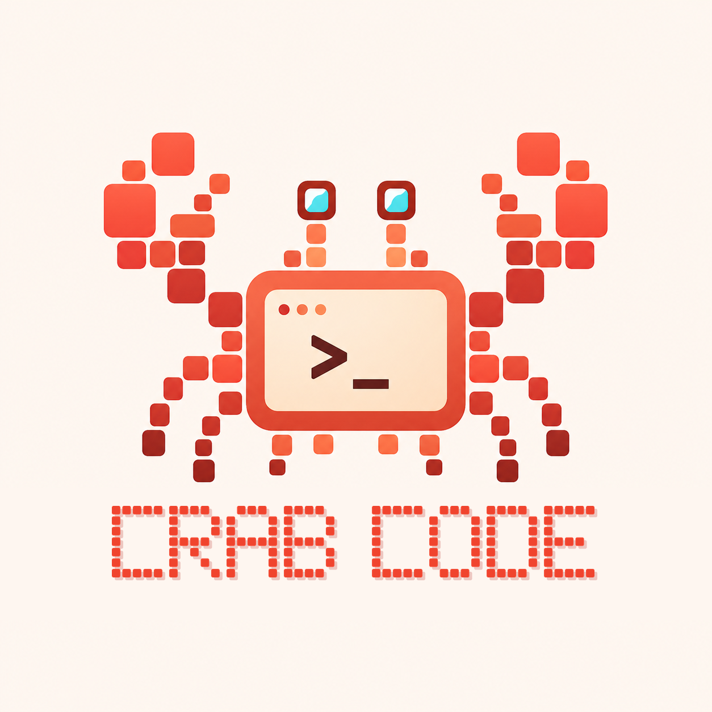

<p align="center">
  
</p>

<h1 align="center">CrabCode TUI</h1>

<p align="center">An open-source terminal coding agent with a native Rust UI, TypeScript agent runtime, and isolated Go OAuth bridge.</p>

<p align="center"><a href="README.md">简体中文</a> · <a href="https://github.com/acosmi/CrabCode-TUI/releases/latest">TUI releases</a> · <a href="https://acosmi.com/zh/downloads">GUI download</a></p>

CrabCode TUI is CrabCode's terminal-only open-source edition. Rust owns the terminal, rendering, and local process lifecycle; it directly launches the TypeScript business runtime. An isolated Go Account Bridge starts only when account OAuth is needed. This repository contains no desktop/web GUI, React/Ink UI, AppServer, shared-application communication layer, archived implementation, or internal project plans.

## Install or choose a product

### TUI (this open-source repository)

macOS / Linux:

```bash
curl -fsSL https://github.com/acosmi/CrabCode-TUI/releases/latest/download/install.sh | sh
```

Windows PowerShell:

```powershell
irm https://github.com/acosmi/CrabCode-TUI/releases/latest/download/install.ps1 | iex
```

Complete platform archives are also available from [GitHub Releases](https://github.com/acosmi/CrabCode-TUI/releases/latest). They bundle `crabcode`, the native TUI, Bun, memory and cron sidecars, ripgrep, the browser backend, native image libraries, and the Account Bridge, so users do not need a separate Rust, Bun, or Go toolchain. Installers verify the release SHA-256 and then the package's per-file manifest. Supported targets are macOS/Linux arm64 and x64, plus Windows x64.

### GUI (separate product, not open-sourced here)

Download the desktop GUI from the [official CrabCode GUI page](https://acosmi.com/zh/downloads). Its source, project files, application communication implementation, and installers are outside this repository and are not hidden in archives or history branches.

## Account, GO membership, and models

The account entry supports OAuth login. Registration includes a complimentary **six-month GO subscription membership**, and inviting friends can earn **reset counts**. Current GO membership access includes **DeepSeek-V4, Mino, and Qwen 3.7 Fast**.

**GO is the product membership name, not the Go programming language.** Eligibility, regions, model availability, quotas, reset rules, and service terms follow the live service shown after sign-in. The MIT source license does not grant subscriptions, model quota, third-party APIs, hosted services, or trademark rights.

## Architecture today

| Layer | Current implementation | Responsibility |
| --- | --- | --- |
| Core/foundation | Rust | Terminal ownership, input/rendering, launcher, process supervision, sandbox foundation, memory, search, cron, and local lifecycle |
| Business layer | TypeScript | Agent orchestration, sessions, tools, permission decisions, model and account business logic, compiled into one TUI runtime bundle |
| Account access | Go | Isolated loopback-only Account Bridge for OAuth credentials and provider protocols; no FFI embedding into Rust/TS |

```text
Terminal
  └─ Rust crabcode launcher / native TUI
       ├─ Rust memory, search and cron sidecars
       └─ private structured stdio
            └─ TypeScript agent runtime (bundled Bun)
                 └─ Go Account Bridge (only for OAuth account flows)
```

Rust and TypeScript communicate through a process-private structured stdio protocol, not a GUI/AppServer or shared-app transport. Before login, the package verifies the Account Bridge version, platform, signed provenance, fixed plugins, SBOM, and third-party license materials.

## OAuth upstream acknowledgment

The `components/oauthapi-llm` sidecar is an MIT-licensed derivative of [`router-for-me/CLIProxyAPI`](https://github.com/router-for-me/CLIProxyAPI), pinned to [`v7.2.71`](https://github.com/router-for-me/CLIProxyAPI/releases/tag/v7.2.71) / commit [`5b7f2361ee27d195f6514dde08656f6e4773a9a4`](https://github.com/router-for-me/CLIProxyAPI/commit/5b7f2361ee27d195f6514dde08656f6e4773a9a4). We thank its maintainers and contributors for the OAuth login and provider-protocol foundation.

Local changes include branding, a restricted loopback surface, fixed-account routing, regional/connector policy verification, credential hardening, fixed plugins, and release verification. This derivative is not an official Router-For.ME distribution and implies no model-provider endorsement. See the component [`NOTICE`](components/oauthapi-llm/NOTICE), [`UPSTREAM.lock`](components/oauthapi-llm/UPSTREAM.lock), and [`LICENSE`](components/oauthapi-llm/LICENSE).

## All-Rust destination

The maintainers' long-term destination is an **all-Rust product runtime**. That is a roadmap, not a claim about today: the foundation is Rust, the business layer remains TypeScript, and the OAuth Account Bridge remains Go.

- Prefer Rust for new foundational and cross-layer capabilities.
- Freeze behavior, protocols, state machines, and security boundaries before replacing TS/Go pieces.
- Move OAuth only after credential isolation, provider compatibility, provenance checks, and recovery meet or exceed current behavior.
- Remove Bun or Go only after parity, regression coverage, and rollback paths are complete.

The TypeScript and Go code are therefore supported production transition implementations, not archived code.

## Included source

| Area | Source |
| --- | --- |
| Native terminal UI and pure launcher | `crates/crabcode-tui`, `crates/crabcode-cli` |
| Direct agent/tool runtime | `src`, with the sole entry at `src/entrypoints/tuiRuntime.ts` |
| Cron sidecar | `crates/crabcode-cron` and its Rust dependency closure |
| Memory and search | `libs/acosmi-memory`, `libs/acosmi-se` |
| OAuth Account Bridge | `components/oauthapi-llm` |
| Patched/pinned terminal, diagram, and platform dependencies | `third_party` and rendering crates |
| Build, verification, and releases | `scripts`, `.github/workflows` |

`bun run check:boundary` fail-closes on GUI/AppServer/Ink paths, extra crates/scripts/workflows, unreachable TypeScript source, archives and binaries, internal plans, and project instruction files such as `AGENTS.md` or `CLAUDE.md`.

## Build from source

Prebuilt-package users do not need these tools. Source development requires Bun 1.3.11+, Rust 1.92+, the Go version declared in `components/oauthapi-llm/go.mod`, and Git:

```bash
git clone https://github.com/acosmi/CrabCode-TUI.git
cd CrabCode-TUI
bun install --frozen-lockfile
bun run build
```

Individual targets:

```bash
bun run build:ts
bun run build:rust
bun run build:memory
bun run build:account-bridge
```

Development launch:

```bash
bun run build:ts
CRABCODE_TUI_RUNTIME_SCRIPT="$PWD/dist/tui-runtime/index.js" \
CRABCODE_TUI_BUN="$(command -v bun)" \
cargo run --manifest-path crates/Cargo.toml \
  -p crabcode-tui --features terminal-lifecycle-tests
```

The production launcher accepts only a closed runtime layout within one immutable version directory; the environment seam above exists only under the test/development feature.

## Verification

```bash
bun run check
bun run test
bun run test:rust
bun run test:memory
bun run test:search
bun run test:account-bridge
bun run smoke:tui
```

`bun run ci` runs the full local validation. Release CI additionally builds on five native platforms, verifies Account Bridge signatures, writes a per-file manifest, collects dependency licenses, validates the install layout, and produces SHA-256 files plus GitHub build provenance for release assets.

## Open source and licenses

Original CrabCode TUI code is under the [MIT License](LICENSE). Derivative and vendored components retain their Apache-2.0, MIT, or other component-specific terms; release packages include exact dependency licenses and a materials inventory. See the [open-source scope](OPEN_SOURCE.md), [third-party notices](THIRD_PARTY_NOTICES.md), [contribution guide](CONTRIBUTING.md), and [security policy](SECURITY.md).
